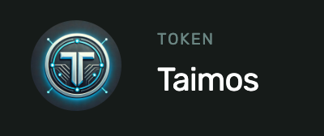
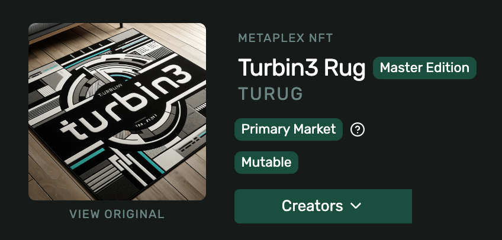

# Taimonania's Turbin3 Q4 Builders cohort

This repository includes all work I completed for the Turbin3 Q4 2024 Builders cohort.

**Public key of Dev Wallet**: `5gAoKd7LyZ6mvHoJ2cBNwsL871NE6kKgYMSYEdRs4j33``

  
Class Notes

## Week 1: Class 1

We learned how to create a new SPL token, how to mint it to a Token Account of our dev wallet and how to transfer it to another Token Account.

### Create, Mint and Transfer SPL tokens

Token address: `FUYXdt7JvuctJzUYFCjUQscUeK26vFNCE6zt9r5D1xnC`

[Created an SPL token](https://explorer.solana.com/tx/5K2wszMYqzM9rMZkZtBNyxvCamGG6u3yCBC2rcZGtAXocsCNHYVugfL3VRcKarGeYupRpoLVGBa28jDg1ycwbpXG?cluster=devnet) on devnet, [Initialized Token Account](https://explorer.solana.com/tx/3ezysbTjSXpyVkkVtDCZz4HeYiP5YiVxkuguUPgy7hCCPQjYessCXwhRZcmGZFm2Ngu35SgfByUBbMQonJVCww1G?cluster=devnet) for my Dev Wallet, [Minted 1 TAIMO](https://explorer.solana.com/tx/3cwjjzqD49VZyWsiMtK95ntAhGE3CVmYjHFo4U3DCwtAzGA7HtzADRvQWHBJWqepvTsrGGz2xwzdPLW5vsqpp3Zr?cluster=devnet) into my Dev Wallet.

Related files:

- `solana-starter/ts/cluster1/spl_init.ts`
- `solana-starter/ts/cluster1/spl_mint.ts`
- `solana-starter/ts/cluster1/spl_transfer.ts`

## Week 1: Class 2

Nick from Solana Foundation did a talk about Blinks. Homework was to add metadata to our SPL token using the umi library.

### Add Metadata to SPL token

[Attach Metadata](https://explorer.solana.com/tx/5AVd7cH2nHpxL18Xk6DJKmWAN3iKDKGQMBeQZcxYnafKpvNxUwiJ1FPpyR9nm3yG1TbUNMu8JcHKWHmicaogyGdS?cluster=devnet) to the SPL token TAIMO.

Related files:

- `solana-starter/ts/cluster1/spl_metadata.ts`

## Week 1: Class 3

Learned how to create and mint an NFT using the metaplex standard. Minted a bunch of different NFTs (mostly Rug-related) and some traded them for devnet SOL.

1. Upload NFT image to arweave using irys
2. Upload metadata json to arweave using irys
3. Mint NFT with URI to the metadata json attached

### Create NFT with Metadata and Mint it

I created many different NFTs, here is the best:

#### Turbin3 Rug

NFT Address: `GzGMnubLCMhDrJyF81k8c2C5d8P5aLdRKxAWJEXXDQr1`

####

Related files:

- `solana-starter/ts/cluster1/nft_image.ts`
- `solana-starter/ts/cluster1/nft_metadata.ts`
- `solana-starter/ts/cluster1/nft_mint.ts`

