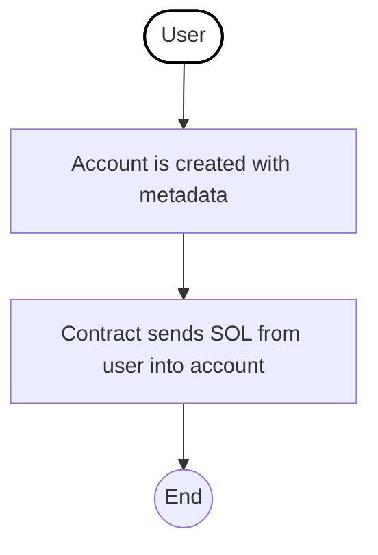

```mermaid
flowchart TD
    User([User]):::actor --> A[Account is created with metadata]
    A --> B[Contract sends SOL from user into account]
    B --> End((End))

    classDef actor fill:#ffffff,stroke:#000000,stroke-width:2px;
```
