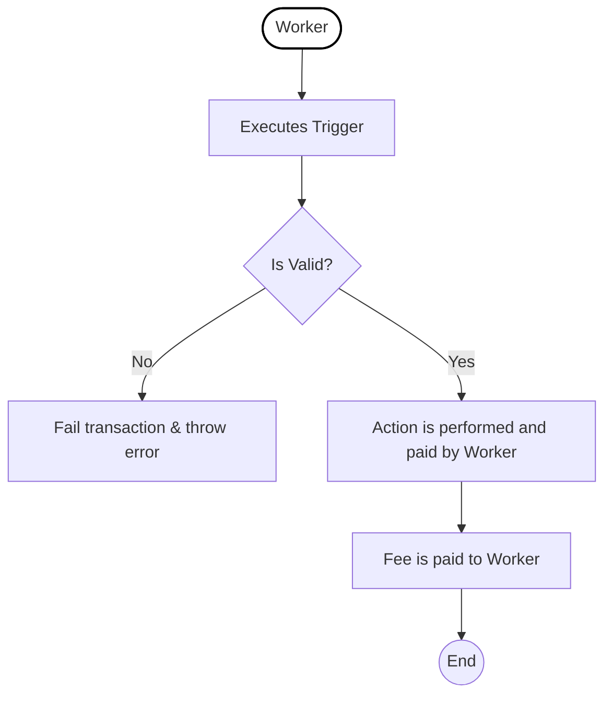

```mermaid
flowchart TD
    Worker([Worker]):::actor --> A[Executes Trigger]
    A --> B{Is Valid?}
    B -- No --> C[Fail transaction & throw error]
    B -- Yes --> D[Action is performed and paid by Worker]
    D --> E[Fee is paid to Worker]
    E --> End((End))

    classDef actor fill:#ffffff,stroke:#000000,stroke-width:2px;
```