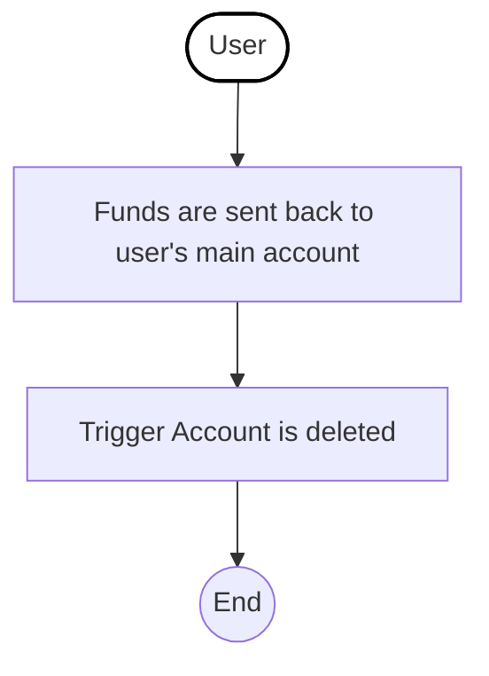

```mermaid
flowchart TD
    User([User]):::actor --> A[Funds are sent back to user's main account]
    A --> B[Trigger Account is deleted]
    B --> End((End))

    classDef actor fill:#ffffff,stroke:#000000,stroke-width:2px;
```